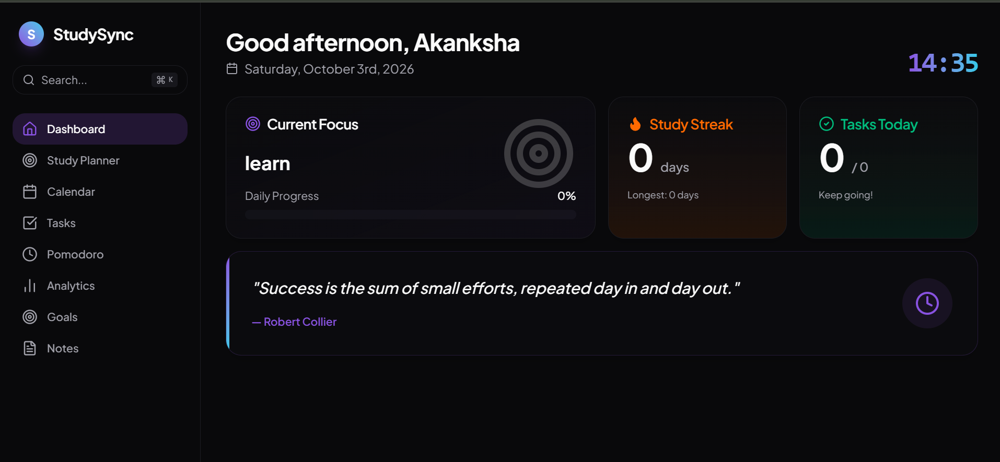
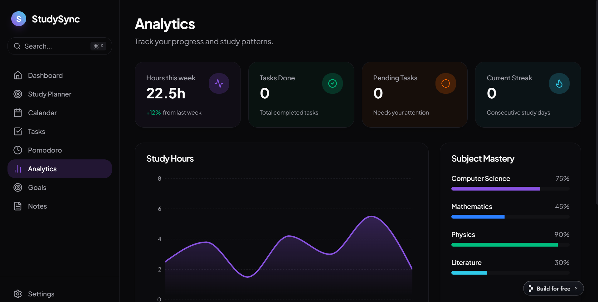
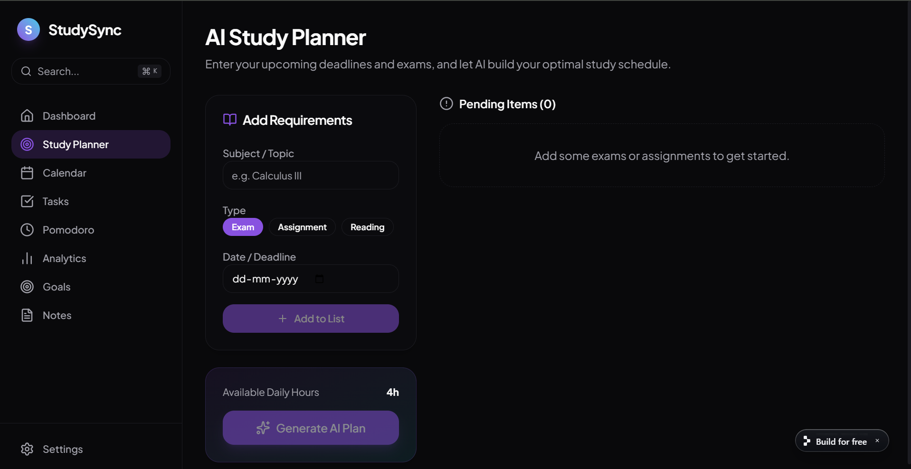

# 📚 StudySync AI

A modern AI-powered study planner designed to help students organize their academic life, manage tasks, track progress, and stay productive through a clean and intuitive interface.

## 🌐 Live App

[Visit StudySync AI](https://study-planner-ai--makanksha815.replit.app/planner)

## ✨ Features

- 📅 Smart Study Planner
- ✅ Task Management
- 🎯 Goal Tracking
- 📊 Productivity Dashboard
- 📈 Progress Analytics
- 📝 Notes Management
- ⏰ Pomodoro Timer
- 🌙 Dark Mode
- 📱 Fully Responsive Design
- 🤖 AI Study Planner (Prototype)

## 📸 App Preview

### Dashboard

### Analytics

### AI Study Planner

## 🛠️ Tech Stack

- React
- TypeScript
- Tailwind CSS
- Vite
- shadcn/ui
- Lucide React

## 📌 Future Enhancements

- AI-powered personalized study plans
- Google Calendar integration
- Cloud synchronization
- User authentication
- Flashcards and quizzes
- Voice assistant

## 👩‍💻 Author

**Akanksha Mishra**

⭐ If you found this project interesting, consider giving it a star!
